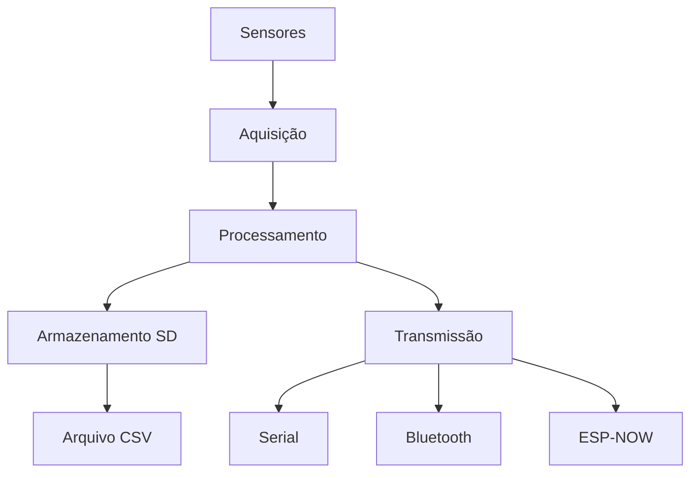

# 📚 Documentação Técnica - Sistema de Teste Estático

Esta documentação está organizada para fornecer todas as informações necessárias para entender, utilizar e contribuir com o projeto.

## 🗂️ Estrutura da Documentação

### 1. Guia de Instalação

- Requisitos de hardware e software
- Configuração passo a passo do ambiente
- Primeira execução e verificação
- Solução de problemas de instalação

### 2. Documentação de [hardware](hardware.md)

- Lista completa de componentes (BOM)
- Esquemáticos e diagramas de conexão
- Especificações técnicas dos sensores

### 3. Documentação de [Firmware](firmware.md)

- Arquitetura do sistema e fluxo de dados
- Configuração e calibração
- Protocolos de comunicação

### 4. Protocolos

- Comandos via Serial/Bluetooth
- Estrutura de dados e mensagens
- Protocolo ESP-NOW
- Formato dos arquivos de log

### 5. Procedimentos de Calibração

- Calibração da célula de carga
- Ajuste do sensor de pressão
- Configuração do RTC
- Validação dos sensores

### 6. Guia de Troubleshooting

- Problemas comuns e soluções
- Diagnóstico de falhas
- Procedimentos de recovery
- Logs e depuração

## 📊 Diagramas Técnicos

Arquitetura do Sistema

```
[Sensores] → [ESP32] → [Armazenamento] → [Comunicação]
    ↓           ↓           ↓               ↓
Célula Carga  Process.   Cartão SD      Serial/BT
Sensor Press.  Dados     Estrutura      ESP-NOW
    RTC        Filtro    Timestamp      Monitoramento
```

Fluxo de dados



## 🛠️ Recursos Técnicos

### Especificações do Sistema

- Microcontrolador: ESP32
- Sensores: Célula de carga + HX711, Sensor de pressão, RTC DS3231
- Armazenamento: Cartão SD (FAT32) + Módulo leitor
- Comunicação: Serial, Bluetooth, ESP-NOW
- Alimentação: 5V DC
- Consumo: ~150mA em operação

### Formatos de Dados

- Logs: CSV com timestamp
- Configuração: Preferences (EEPROM)
- Comunicação: Strings delimitadas
- Armazenamento: Estrutura hierárquica por data/hora

## 🤝 Contribuindo para a Documentação

1. Encontrou algum erro ou tem sugestões de melhoria
2. Reporte Issues: Abra uma issue no GitHub descrevendo o problema
3. Sugira Melhorias: Proponha novas seções ou conteúdos
4. Envie Correções: Pull requests são bem-vindos
5. Compartilhe Experiências: Casos de uso e exemplos práticos
